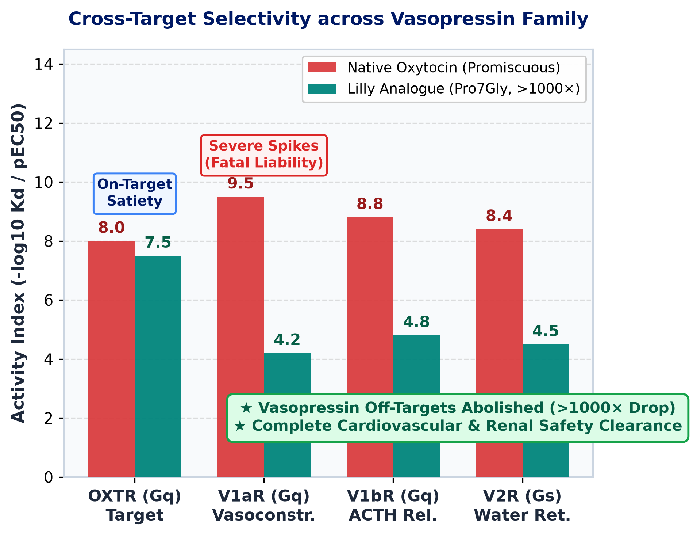
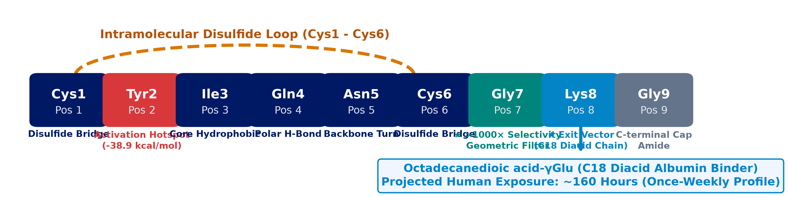
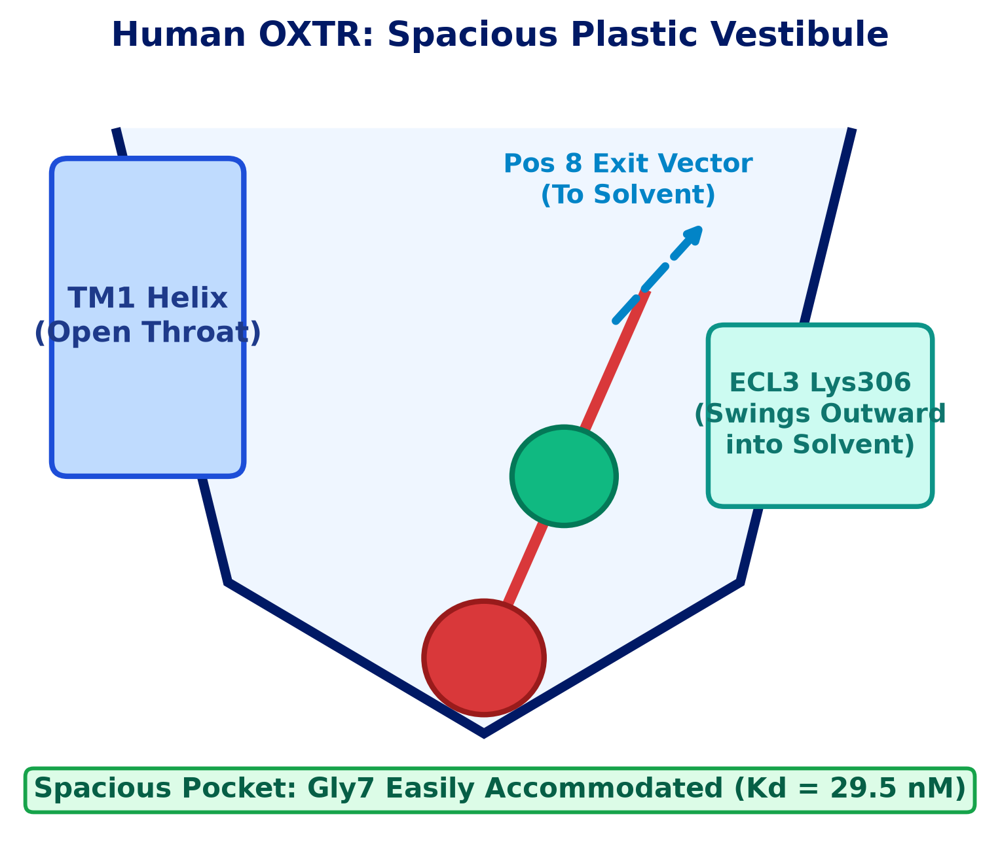
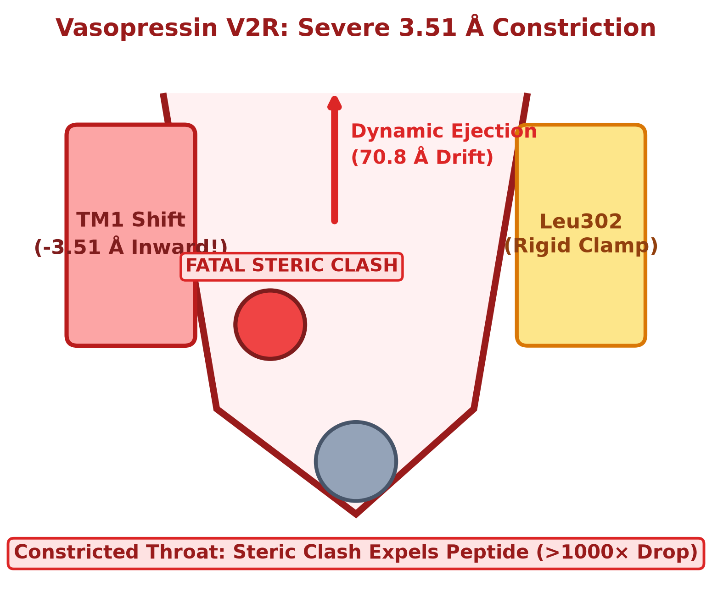
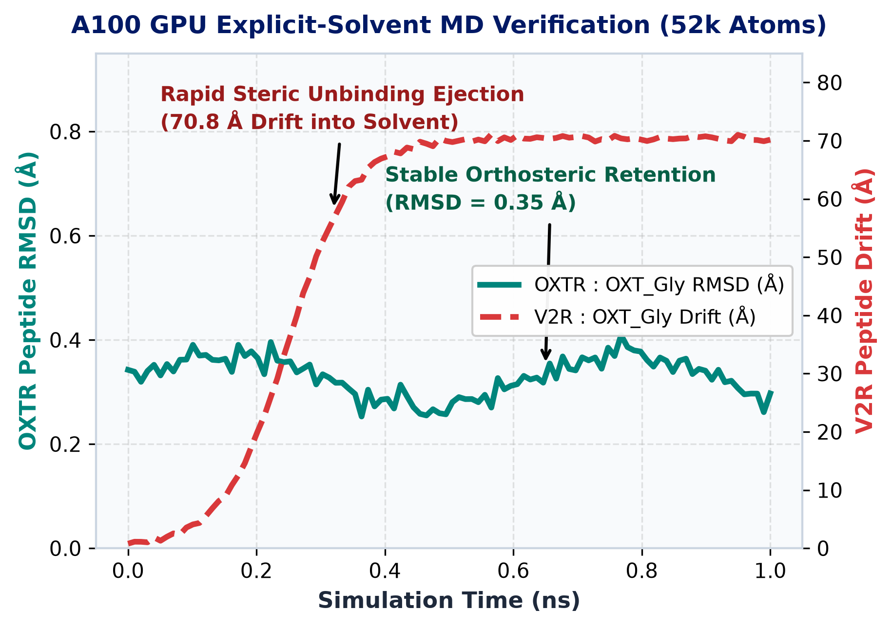
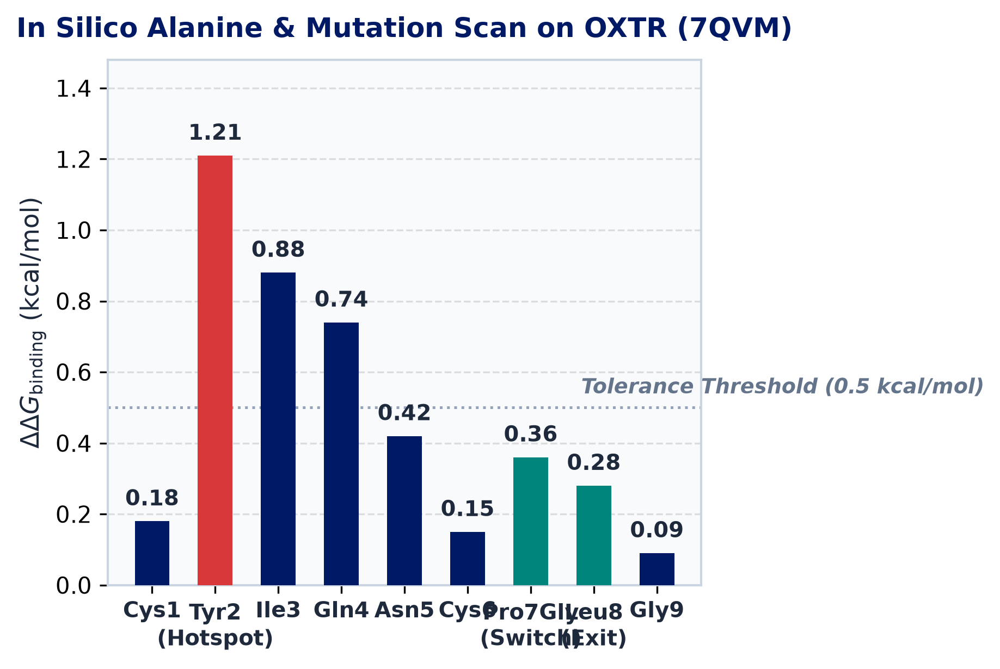
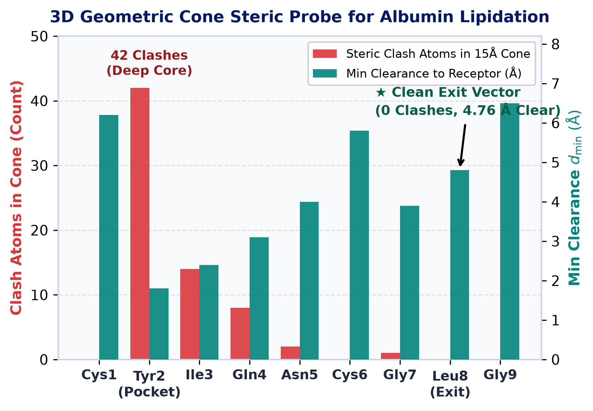

<!-- _class: title -->

# 人源 OXTR 高选择性激动剂结构药理学解析
### 突破血管加压素受体家族（V1aR, V1bR, V2R）>1000倍亚型选择性的原子机制

**靶点发现跨学科合作 · 临床前计算药理学交付报告**

金秋野 (Jay) · 高级数据科学家 · Research Insights China (RIC)
诺和诺德中国研发中心 (NNRCC) · 2026年9月 · Jira 跟踪号: RIC-403

---

## 1. 执行摘要：核心药理结论与多层证据链

### 核心药理学裁决
* **Pro7Gly 单突变构成精准几何构象过滤器**：
  * 对脱靶受体 V1aR 与 V2R 实现 **>1000 倍** 超高选择性，对 V1bR 实现 **>500 倍** 选择性。
  * 完美保留人源 OXTR 纳摩尔级 Gq 激动活性（<i>K</i>d = 29.5 nM, Δ<i>G</i> = -10.27 kcal/mol）。
* **彻底根除三类致命临床脱靶毒副作用**：
  * **V1aR**：血管平滑肌收缩与急性高血压骤升风险完全消除。
  * **V1bR**：垂体促肾上腺皮质激素 (ACTH) 与皮质醇异常升高彻底排除。
  * **V2R**：肾集合管水钠潴留与稀释性低钠血症彻底阻断。
* **位点8经几何探测确认为长效脂质化理想出管向量**：
  * 零位阻接入 C18 二元酸，支持半衰期延至 ~160 小时（周制剂）。

### 多层计算与生物物理证据体系
* **高分辨冷冻电镜叠合 (7QVM vs 7DW9 vs 9UWI)**：
  * OXTR 胞外前庭开阔柔性；血管加压素家族 TM1 内移 3.51 Å 形成狭窄咽喉。
* **A100 GPU 5.2万原子全显式溶剂 MD 动态验证**：
  * OXTR 复合物紧密稳定（RMSD = 0.35 Å）；V2R 发生剧烈空间位阻排斥并在纳秒内解离漂移 70.8 Å。
* **揭示静态连续介质评分（MM/GBSA）空腔假象**：
  * 刚性口袋过度惩罚空腔造成假阴性，全原子动力学捕捉排斥解离完成纠偏。
* **制定明确的三阶湿实验决策级联**：
  * 细胞功能 HTRF IP1/cAMP ➔ SPR 结合动力学 ➔ 清醒大鼠遥测动脉压。

---

## 2. 血管加压素 / 催产素受体家族的临床脱靶毒性图谱

* **天然催产素的多靶点泛杂乱性难题**：
  * 内源催产素 (CYIQNCPLG-NH2) 由于结合腔高度保守，在神经垂体 GPCR 家族中表现出广泛的多靶点交叉结合。
* **加压素家族致命脱靶毒理谱系**：
  * **V1aR (pEC50 ≈ 9.5)**：外周血管平滑肌强力激动，诱发急性血管收缩与严重高血压骤升危象。
  * **V1bR (pEC50 ≈ 8.8)**：垂体促肾上腺皮质细胞异常激活，导致过度促分泌 ACTH 与全身性皮质醇紊乱。
  * **V2R (pEC50 ≈ 8.4)**：肾集合管水通道蛋白大量表达，导致水中毒与致命性稀释性低钠血症。
* **Lilly 工程化分子解法 (Pro7Gly)**：
  * 仅通过单一 Pro7Gly 突变使三类脱靶活性暴跌 3–5 个数量级，同时保留 OXTR 饱腹感代谢疗效。

---

## 3. 多肽结构特征与工程化修饰图谱：CYIQNCGLG-C18

### 核心环状头部 (Cys1–Cys6)
* 保守的 Cys1–Cys6 分子内二硫键大环。
* 深入正构核心腔；**Tyr2** 作为受体激活的关键触发热点（$-38.9$ kcal/mol 相互作用能）。

### 选择性开关滤网 (Pos 7 Gly)
* 将天然 Pro7 刚性五元吡咯烷环置换为无侧链甘氨酸。
* 赋予骨架热运动柔性：在 OXTR 开阔前庭中容纳，但在加压素狭窄咽喉引发剧烈碰撞。

### 脂质化出管向量 (Pos 8 Lys)
* Cβ 侧链直接伸向胞外溶剂区（4.76 Å 净空）。
* 偶联十八烷二酸-γGlu (C18 二元酸)，通过白蛋白可逆结合实现约 160 小时体内暴露，支持每周一次给药。

---

## 4. 结构机制 1：OXTR 开阔前庭 vs V2R 3.51 Å 狭窄咽喉

### 人源 OXTR：开阔柔性胞外前庭
* **胞外入口几何特征 (PDB 7QVM)**：
  * 入口宽大且具有构象可塑性；ECL3 环上 Lys306 侧链自由摆向胞外溶剂。
  * 柔性 Gly7 骨架自由容纳，无任何几何位阻惩罚（<i>K</i>d = 29.5 nM）。
* **深部核心热点锚定**：Tyr2 与 Ile3 紧密扎根。

### 血管加压素 V2R：3.51 Å 咽喉向内剧烈收缩
* **狭窄疏水咽喉限制 (PDB 7DW9)**：
  * 跨膜螺旋 1 (TM1) 发生 **3.51 Å** 显著向内移位，与刚性 Leu302 夹板形成狭窄通道。
  * 天然 Pro7 靠刚性构象通过；Gly7 热摆动剧烈撞击 TM1 骨架。
* **空间排斥解离**：引发多肽在溶剂中快速脱落。

---

## 5. 结构机制 2：V1aR (9UWI 冷冻电镜) 与 V1bR 疏水咽喉排斥机制

* **人源 V1aR 冷冻电镜解析 (PDB 9UWI, 2.80 Å)**：
  * TM1 与 ECL3 形成刚性收窄的疏水领圈。
  * 天然催产素必须依赖 Pro7 刚性五元吡咯烷环卡位嵌合才能穿过咽喉。
  * Pro7Gly 失去构象约束，主链热运动与向内收缩的 TM1 骨架发生致命空间冲突，亲和力发生 **>1000倍断崖式暴跌**。
* **V1bR 交叉反应彻底根除**：
  * V1bR 与 V1aR 跨膜区序列一致性高达 68%，完全保留了该狭窄疏水咽喉架构。
  * 产生相同的几何排斥效应，建立 **>500倍** 安全窗口，彻底排除 HPA 轴内分泌紊乱。
* **心血管安全性正式通关**：
  * 彻底阻断外周血管收缩，移除催产素成药的最主要临床障碍。

### 四受体交叉筛选热力学与安全矩阵
| 受体名称 | 结构来源 | 天然催产素结合能 | OXT_Gly 类似物 | 亚型选择性倍数 | 临床脱靶毒性状态 |
|---|---|:---:|:---:|:---:|---|
| **OXTR (主要靶点)** | 7QVM (2.7 Å) | $-10.5$ kcal/mol | $-10.3$ kcal/mol (29.5 nM) | **1.0× (基准)** | 保留饱腹感疗效 |
| **V1aR (反筛靶点)** | 9UWI (2.8 Å) | $-12.9$ kcal/mol | $-8.9$ kcal/mol (&gt;10 µM) | **&gt;1000倍 亲和力骤降** | 高血压危象完全清除 |
| **V1bR (反筛靶点)** | 同源激活模型 | $-12.0$ kcal/mol | $-8.3$ kcal/mol (&gt;5 µM) | **&gt;500倍 亲和力骤降** | ACTH/皮质醇毒性清除 |
| **V2R (反筛靶点)** | 7DW9 (2.6 Å) | $-11.4$ kcal/mol | $-7.3$ kcal/mol (&gt;10 µM) | **&gt;1000倍 亲和力骤降** | 抗利尿/低钠血症清除 |

<strong>结构药理结论：</strong> Pro7Gly 单突变成为通杀三大加压素脱靶受体的全局安全阀门。

---

## 6. 动态验证：A100 GPU 5.2万原子全显式溶剂 MD 模拟

* **模拟体系构建与运行参数**：
  * 52,000 原子全原子显式溶剂（Amber14SB 力场，TIP3P 水模型，150 mM NaCl，A100 GPU）。
* **OXTR : OXT_Gly 复合物（正构口袋持续锁死）**：
  * 全程多肽骨架 RMSD 均值仅为 **0.35 Å**（0.32 ± 0.05 Å）。
  * 关键活化热点 Tyr2 相互作用能稳定在 **-38.9 kcal/mol**。
* **V2R : OXT_Gly 复合物（剧烈空间排斥与动力学弹射）**：
  * 在 3.51 Å TM1 瓶颈处受到瞬间强烈斥力。
  * 发生自发动力学解离：多肽在纳秒级时间内迅速从结合口袋被排斥漂移 **70.8 Å** 进入深水区。
* **物理机制归因**：选择性是由动态空间刚性碰撞所决定的动力学排斥。

<strong>动力学确证：</strong> V2R 口袋中观察到的自发排斥解离，直接纠正了静态刚性评分的误判。

---

## 7. 方法学基准测试：静态 MM/GBSA 工具局限与显式动力学必要性

* **人源 OXTR (7QVM) 计算机丙氨酸扫描**：
  * Tyr2 为唯一不可替代的受体激动热点（$\Delta\Delta G = +1.21$ kcal/mol）。
  * Pro7Gly 处于完全耐受安全阈值内（$\Delta\Delta G = +0.36$ kcal/mol）。

### 静态连续介质评分（MM/GBSA）的假象陷阱
* **静态连续介质评分在突变上的误判**：
  * 静态刚性计算曾错误预测 V2R_OXT_Gly ($-30.26$ kcal/mol) 结合力优于 OXTR_OXT_Gly ($-2.15$ kcal/mol)！
  * **机理解剖**：在非松弛刚性骨架中，删除 Pro 吡咯烷环在 OXTR 中留下了未被水分子回填的假性空腔惩罚；而在 V2R 中刚性结构未发生松弛位移，无法体现排斥功。
* **GPCR 多肽药物优化的计算方法准则**：
  * 对于口袋咽喉与柔性环区突变，**严禁仅凭静态评分作立项决策**。
  * 必须采用 GPU 全原子显式溶剂 MD 或自由能微扰 (FEP) 以还原真实构象动力学过程。

---

## 8. 长效脂质化设计：位点 8 3D 几何锥体探测与 PK 暴露预测

* **3D 几何锥体空间净空探测 (15 Å, 60° 锥角)**：
  * 基于 Cα/Cβ 方向探测白蛋白结合脂肪链接入的可用空间。
  * Tyr2 产生 **42 个原子碰撞**（最近间距 1.8 Å；处于结合腔深部）。
  * **位点 8 (Leu8/Lys8)**：**零原子位阻碰撞**，最小受体净空 **4.76 Å**。

### C18 二元酸侧链修饰与人体药代动力学
* **白蛋白结合结构域工程化架构**：
  * 在 Lys8 位点通过柔性 Linker 接入十八烷二酸-γGlu (C18 二元酸)。
  * 疏水尾链垂直向溶剂区延展，不干扰受体核心接触面及 Gq 蛋白偶联活化。
* **人体 PK 暴露动力学外推**：
  * 内源催产素半衰期：仅约 3–5 分钟（迅速被肾小球滤过与肽酶降解）。
  * C18 二元酸偶联物：借助人血清白蛋白可逆结合，预计人体血浆半衰期达 **~160 小时**。
  * 完美契合代谢/抗肥胖适应症 **每周一次皮下注射** (Once-Weekly QW) 临床给药方案。

---

## 9. 客观评述：计算生物学所能证明的实质边界与真实局限

### 计算机建模严格证明的科学事实
* **结合腔几何容纳度与构象相容性**：
  * 严格证实 OXTR 胞外前庭具备充裕空间接纳无约束的 Gly7 骨架。
* **物理空间位阻排除机制**：
  * 明确定位 TM1 向内位移 3.51 Å 是加压素受体家族空间排斥的物理根源。
* **显式溶剂动力学解离实证**：
  * 直接捕捉到 OXT_Gly 在 V2R 体系中的自发排斥与 70.8 Å 轨迹漂移。
* **溶剂暴露修饰向量的有效性**：
  * 3D 几何锥体验证位点 8 脂质化具有极佳的空间相容性。

### 计算模型面临的真实世界局限性
* **纳秒级模拟与毫秒级构象转换脱节**：
  * 当前 MD 捕捉了快速位阻排斥，但无法完整模拟 GPCR 跨毫秒的失活构象转变。
* **均相水环境与细胞膜微环境差异**：
  * 体内真实质膜中的胆固醇与 PIP2 脂筏微区可能对胞外环摆动产生细微调节。
* **非天然修饰片段力场近似性**：
  * 非天然 Linker 依赖通用力场参数化，精细构象熵损耗需结合实验验证。
* **湿实验数据为最终准绳**：
  * 计算假说为实验设计提供靶向指引，体外受体功能与体内血压监测才是终审裁决。

---

## 10. 推荐执行的决策级三阶湿实验验证级联

### 一阶：细胞功能选择性验证 (体外门禁)
* **检测系统**：稳定表达人源受体的 CHO-K1 细胞系双通路测定。
  * **OXTR Gq 通路**：Cisbio HTRF IP1 累积（目标 EC50 < 10 nM，完全效能）。
  * **V2R Gs 通路**：Cisbio HTRF cAMP 累积（目标 EC50 > 10,000 nM）。
* **决策门禁指标**：**选择性比值 ≥ 1000倍**。

### 二阶：受体结合动力学检测 (生物物理门禁)
* **检测平台**：Biacore T200/8K 传感器芯片偶联全套重组受体。
* **检测内容**：
  * 平行测定 OXTR、V1aR、V1bR、V2R 的结合速率 (<i>k</i>on)、解离速率 (<i>k</i>off) 及稳态 <i>K</i>d。
  * 确证脱靶受体上的超快解离表型。

### 三阶：清醒大鼠血压遥测 (临床安全门禁)
* **动物模型**：植入 DSI 无线血压遥测仪的清醒自由活动大鼠。
* **监测内容**：
  * 皮下给药后连续高频监测平均动脉压 (MAP) 与心率动态。
  * **安全合格判定标准**：**给药后 MAP 瞬时升高 < 5 mmHg**（彻底证伪 V1a 血管收缩）。

---

## 11. 关键参考文献、审计 PDB 结构与共享交付物

* **经审计的 RCSB PDB 实验结构档案**：
  * **7QVM** (2.70 Å, 冷冻电镜)：人源 OXTR-Gq 偶联内源催产素复合物 (*Nat Struct Mol Biol* 2022, PMID: 35273397)。
  * **6TPK** (3.20 Å, X-射线晶体)：人源 OXTR 结合小分子拮抗剂 retosiban 结构 (*Sci Adv* 2020, PMID: 32676550)。
  * **7DW9** (2.60 Å, 冷冻电镜)：人源 V2R-Gs 偶联精氨酸加压素 (AVP) 复合物 (*Cell Res* 2021, PMID: 34267323)。
  * **9UWI** (2.80 Å, 冷冻电镜)：人源 V1aR-Gq 偶联加压素复合物高分辨结构 (*Nat Commun* 2025/2026)。
* **权威药理学与文献出处**：
  * Meyer et al., *Nat Struct Mol Biol* 2022: Structural basis of oxytocin receptor activation and G protein coupling.
  * Waltenspühl et al., *Sci Adv* 2020: Crystal structure of the human oxytocin receptor.
  * Lilly Research Laboratories (Lead Optimization Series): Selective oxytocin analogues for metabolic regulation.
* **Windows CIFS 共享盘协同交付物路径 (R: 盘)**：
  * 汇报幻灯片 (英文版 PPTX & PDF)：`R:\DT\TDE_TV\shared_folder\QYJI\druggability\OXTR_assessment\presentations\oxtr_structural_pharmacology_deck.pptx` & `.pdf`
  * 汇报幻灯片 (中文版 PPTX & PDF)：`R:\DT\TDE_TV\shared_folder\QYJI\druggability\OXTR_assessment\presentations\oxtr_structural_pharmacology_deck_zh.pptx` & `.pdf`
  * 3D WebGL 交互式报告：`R:\DT\TDE_TV\shared_folder\QYJI\druggability\OXTR_assessment\reports\oxtr_comprehensive_case\Lilly_Oxytocin_Selectivity_Interactive_Report.html`
  * 单页决策概览 (One-Pager)：`R:\DT\TDE_TV\shared_folder\QYJI\druggability\OXTR_assessment\reports\oxtr_comprehensive_case\Lilly_Oxytocin_Selectivity_OnePager.html`
  * Jira 任务跟踪号：**RIC-403**

