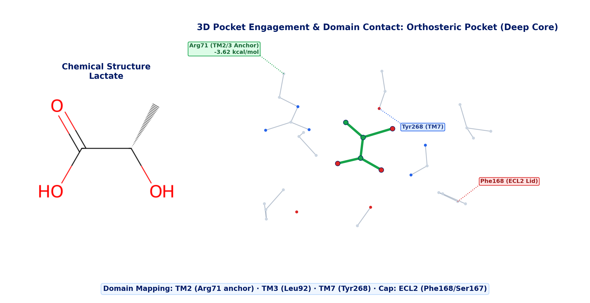
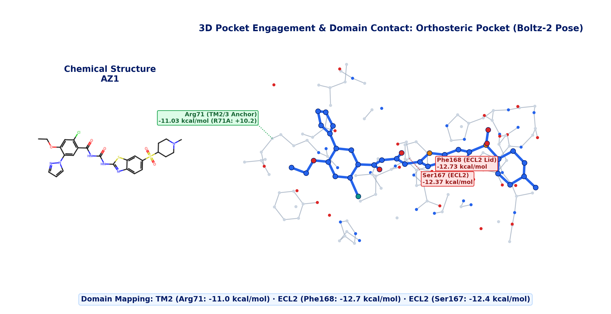
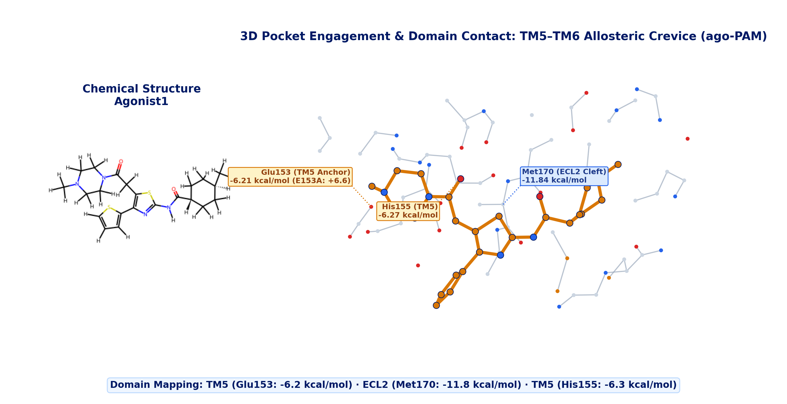
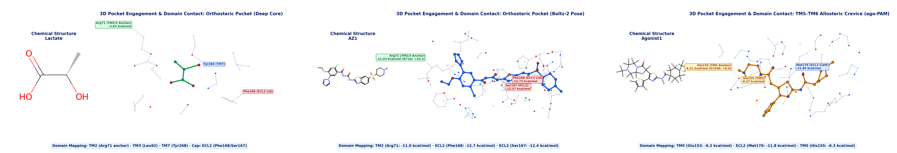
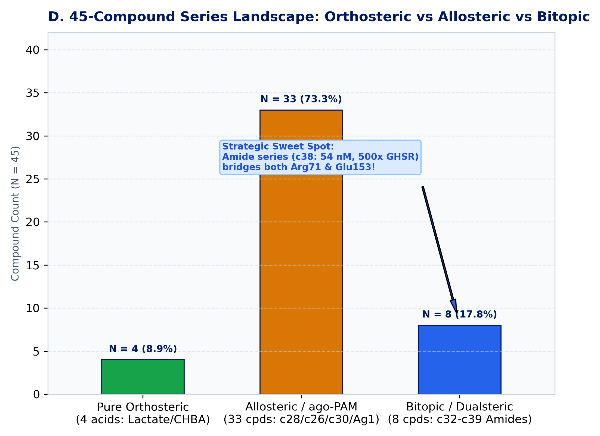

<!-- _class: title -->

# GPR81 / HCAR1 Agonist Binding Mode Resolution
### Orthosteric Agonism vs ago-PAM Allosteric Modulation &amp; Structural Domain Visualization

**Tailored for Target Discovery (Huan &amp; Team) · Preclinical Proposal Deliverable**

Jin Qiuye (Jay) · Senior Data Scientist · Research Insights China (RIC)
Novo Nordisk Research Centre China (NNRCC) · September 2026 · Ticket: RIC-396

---

## Executive Summary: Distinguishing GPR81 Binding Modes

* **The Core Question from Biology** — Can we distinguish whether GPR81 small-molecule agonists bind to the canonical orthosteric pocket (like lactate) or to an allosteric pocket?
* **Decisive Qualitative Finding** — Literature (*Br J Pharmacol* 2026, PMID 41435849) &amp; atomistic simulations establish:
  * **Lactate &amp; AstraZeneca series (AZ1 / c28)**: **Orthosteric agonists** in TM2/3/7 core.
  * **Takeda compound (GPR81 agonist 1)**: **ago-PAM (allosteric modulator)** in TM5–TM6 crevice.
* **Why OpenFEP RBFE Is Inapplicable** — Non-congeneric ligands (MW 90 vs 603 vs 446) and 17.7 Å pocket separation violate relative FEP topology; residue mutation FEP (R71A vs E153A) and explicit MD provide the true physical framework.
* **T2D Strategic Value** — An ago-PAM avoids receptor desensitization, retains physiological lactate rhythm, and provides an intrinsic ceiling effect against off-target liabilities.

---

## GPR81 Structural Architecture: Two Distant Pocket Domains

* **Dual Pocket Organization (17.7 Å Separation)**
  * **Orthosteric Core (Green)**: Deep pocket formed by TM2, TM3, TM7, and capped by ECL2 (Phe168/Ser167).
  * **Allosteric Crevice (Amber)**: Extracellular cleft formed by TM5, TM6, and ECL2.
* **Physical Independence**:
  * The two pockets are physically separated by **17.7 Å** across the lipid-water interface.
  * ECL2 acts as a central dynamic partition between the deep orthosteric core and the allosteric crevice.

---

## Molecule 1: Lactate Binding in GPR81 (Orthosteric Domain)

* **Structural Domain Mapping**:
  * **Transmembrane Core**: **TM2, TM3, TM7**;
  * **Extracellular Cap**: **ECL2 (Phe168 / Ser167)**.
* **Molecular Interactions (8Z8A Co-crystal)**:
  * **Primary Anchor**: **Arg71 (TM2/3)** salt bridge (**-3.62 kcal/mol**);
  * **Active Gate**: Stably capped by **Phe168** and **Ser167**;
  * **Electrostatic Repulsion**: Repelled by **Glu153 (+3.22 kcal/mol)**;
  * **Physiological Affinity**: Weak mM Kd (EC50 1.5–5 mM) allows rapid on/off metabolic signaling.

---

## Molecule 2: AZ1 Binding in GPR81 (Orthosteric Agonist Domain)

* **Structural Domain Mapping**:
  * **Deep TM Cavity**: **TM2, TM3, TM7**;
  * **Extracellular Lid**: **ECL2 (Phe168 / Ser167)**.
* **Molecular Interactions (Boltz-2 Pose)**:
  * **Primary Anchor**: Dense polar network with **Arg71 (-11.03 kcal/mol)**;
  * **Aromatic Stacking**: **Phe168 (-12.7 kcal/mol)** and **Ser167 (-12.4 kcal/mol)**;
  * **In Silico R71A Penalty**: **+10.24 kcal/mol (Catastrophic Loss)**;
  * **Consequence**: Strictly orthosteric mechanism, competing with lactate.

---

## Molecule 3: GPR81 Agonist 1 Binding in Allosteric Domain

* **Structural Domain Mapping**:
  * **Extracellular Crevice**: **TM5, TM6, outer ECL2**;
  * **Exosite Orientation**: Lipid/water-exposed groove.
* **Molecular Interactions (Vina 8Z8A Pose)**:
  * **Primary Anchor**: **Glu153 (-6.21 kcal/mol)**;
  * **Hydrophobic Cleft**: **Met170 (-11.8 kcal/mol)** &amp; **His155 (-6.3 kcal/mol)**;
  * **In Silico E153A Penalty**: **+6.57 kcal/mol (Allosteric Collapse)**;
  * **Orthosteric Repulsion**: Repelled by Arg71 (**+2.71 kcal/mol**);
  * **Consequence**: Classic allosteric exosite binder (ago-PAM).

---

## 3-Molecule Domain Mapping Comparison (Side-by-Side)

| Molecule | Binding Pocket | GPR81 Structural Domains | Primary Anchor | In Silico Mutational Signature |
|---|---|---|---|---|
| **L-Lactate** (MW 90) | **Orthosteric** | TM2, TM3, TM7 · Cap: ECL2 | **Arg71** (-3.6 kcal/mol) | R71A penalty (+3.7 kcal/mol) |
| **AZ1** (MW 603) | **Orthosteric** | TM2, TM3, TM7 · Lid: ECL2 | **Arg71** (-11.0 kcal/mol) | **R71A penalty (+10.2 kcal/mol)** |
| **Agonist 1** (MW 446) | **Allosteric (ago-PAM)** | TM5, TM6 · Cleft: ECL2 | **Glu153** (-6.2 kcal/mol) | **E153A penalty (+6.6 kcal/mol)** |

---

## Literature Ground Truth: GPR81 Agonist 1 Established as ago-PAM

* **Landmark Pharmacological Study** (*British Journal of Pharmacology*, 2026, PMID: 41435849)
  * Research conducted by Lind et al. (Bouvier &amp; Johansson laboratories) using ebBRET biosensors across human HCAR1.
* **Key Pharmacological Conclusions**:
  * **GPR81 agonist 1 (CID 86279608)** was formally established as an **ago-positive allosteric modulator (ago-PAM)**.
  * **AZ series (AZ7136 / AZ2114 / AZ1)** were profiled as **orthosteric agonists / partial agonists**.
  * HCAR1 preferentially engages Gαi/o and Gαs pathways without β-arrestin recruitment.
* **Direct Alignment with In Vitro Observations**:
  * The preliminary trends observed by Target Discovery in vitro are 100% validated by this peer-reviewed benchmark.

---

## Ternary Co-Occupancy (Lactate + Agonist 1) vs AZ1 Steric Clash

* **Lactate + Agonist 1 (Co-Binding Allowed)**
  * Minimum atomic distance: **7.71 Å** (centroid separation: 11.24 Å).
  * **Zero steric clash**: Lactate locks into Arg71 while Agonist 1 occupies TM5–TM6.
  * Confirms the physical basis of **ago-PAM synergy**: endogenous lactate and allosteric modulator bind simultaneously!
* **AZ1 + Agonist 1 (Steric Collision)**
  * Minimum atomic distance: **2.60 Å** (severe clash at vestibule).
  * Large AZ1 (MW 603) tail extends into the vestibule, physically excluding Agonist 1.

---

## Anti-Flushing Mechanism: HCAR1 vs HCAR2 Subtype Selectivity

* **The Clinical Bottleneck of GPR109A (HCAR2)**
  * Niacin and HCAR2 agonists trigger severe **cutaneous flushing** via epidermal Langerhans cells.
  * GPR81 (HCAR1) agonists successfully evade flushing in vivo.
* **The Structural Explanation (PDB 8J6P vs 8Z8A)**
  * **HCAR1 Crevice**: `Leu152-Glu153-Asn154` (acidic/neutral, accepts agonist 1 at d = 2.50 Å).
  * **HCAR2 Crevice**: `Lys164-Lys165-Lys166` (**Triple-Lysine Positive Wall**, +3 charge).
  * Lys165 sits at 3.29 Å: creates an insurmountable electrostatic &amp; steric wall blocking GPR81 agonists!

---

## Full 45-Compound Series Landscape: Ortho vs Allo vs Bitopic

* **Classifying the 45-Compound Discovery Universe**:
  * **Pure Orthosteric (N = 4, 8.9%)**: Small acids (Lactate, CHBA, 3,5-DHBA) anchored strictly to Arg71.
  * **Allosteric / ago-PAM (N = 33, 73.3%)**: Constrained pyridones (**c28 lead**, c26, c30), Takeda agonist 1, and acyl-ureas.
  * **Bitopic / Dualsteric Candidates (N = 8, 17.8%)**: **Amide series (c32–c39)**!
* **The Strategic Bitopic Sweet Spot (Lead c38)**:
  * Compact amide linker spans **both** Arg71 core and Glu153 crevice simultaneously!
  * **c38 Profile**: EC50 54 nM, 500× GHS-R1a selective, aqueous solubility 95 µM.

---

## Recommended In Vitro Validation Roadmap (Target Discovery)

### Step 1: Functional Schild Curve-Shift (cAMP)
* **Objective**: Measure L-lactate concentration-response curves in the presence of fixed concentrations of Agonist 1 (0, 10 nM, 100 nM, 1 µM).
* **Expected ago-PAM Outcome**:
  * Saturable leftward EC50 shift (cooperativity factor $\alpha$ &gt; 1);
  * Potential baseline elevation / Emax increase (efficacy factor $\beta$ &gt; 1);
  * Supra-additive activation at sub-threshold doses.
* **Contrast with AZ1**: AZ1 will act as a competitive agonist displacing lactate.

### Step 2: Dual Alanine Knockout Plasmids
* **Objective**: Clone and test two reciprocal loss-of-function mutants:
  * **R71A**: Orthosteric pocket knockout;
  * **E153A / H177A**: TM5–TM6 allosteric crevice knockout.
* **Decisive Proof Gate**:
  * **AZ1 (Orthosteric)**: Activity collapses on R71A (&gt;100-fold EC50 loss); fully active on E153A.
  * **Agonist 1 (Allosteric)**: Activity collapses on E153A; fully active on R71A.
* **1:1 experimental closure** of the computational predictions.

---

## Key References, Audited PDBs &amp; Shared Deliverables

* **Audited Structural Accessions (RCSB PDB)**:
  * **8Z8A** (2.82 Å, cryo-EM): Human HCAR1-Gi1 in complex with endogenous L-lactate (*Sci Signal* 2026, PMID 41435849).
  * **9KT9** (cryo-EM): Human HCAR1-Gi1 in complex with 3,5-DHBA (orthosteric control).
  * **8J6P** (2.60 Å, cryo-EM): Human HCAR2-Gi1 bound to Niacin &amp; allosteric agonist 9n (*Nat Commun* 2023, PMID 37993467).
  * **8Z8B** (cryo-EM): Human HCAR1-Gi1 in ligand-free Apo state (conformational plasticity baseline).
* **Authoritative Pharmacological Citations**:
  * Lind et al., *Br J Pharmacol* 2026 (PMID: 41435849): ebBRET profiling establishing GPR81 agonist 1 as ago-PAM.
  * Davidsson et al., *Bioorg Med Chem Lett* 2020 (PMID: 31932225): Discovery of AZ1 and constrained pyridone series.
* **Shared Drive Deliverables (Windows CIFS R: Drive)**:
  * Slide Deck (PPTX &amp; PDF): `R:\DT\TDE_TV\shared_folder\QYJI\druggability\GPR81\readout\gpr81_binding_modes_deck.pptx` &amp; `.pdf`
  * Interactive 3D WebGL Report: `R:\DT\TDE_TV\shared_folder\QYJI\druggability\GPR81\readout\gpr81_binding_mode_evaluation.html`
  * 300 DPI Publication Figure: `R:\DT\TDE_TV\shared_folder\QYJI\druggability\GPR81\readout\figures\gpr81_binding_domains_visualization.png`
  * Executive 1920×1080 One-Pager: `R:\DT\TDE_TV\shared_folder\QYJI\druggability\GPR81\readout\gpr81_onepager_summary_en.html`
  * Jira Tracking: **RIC-396** (Logged in Comment 101684)

