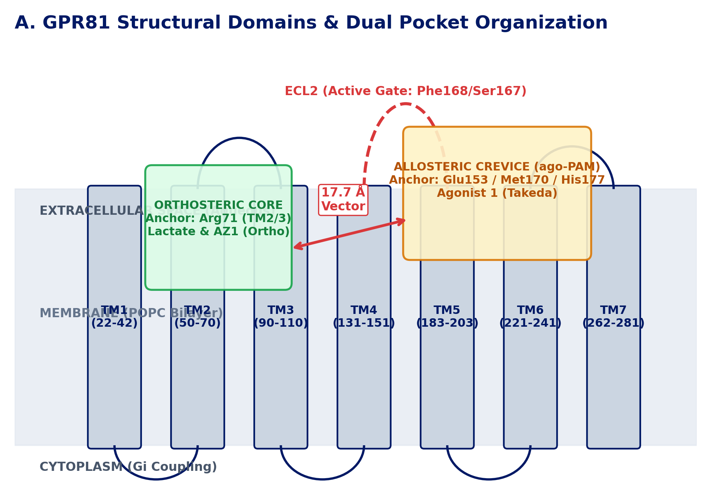
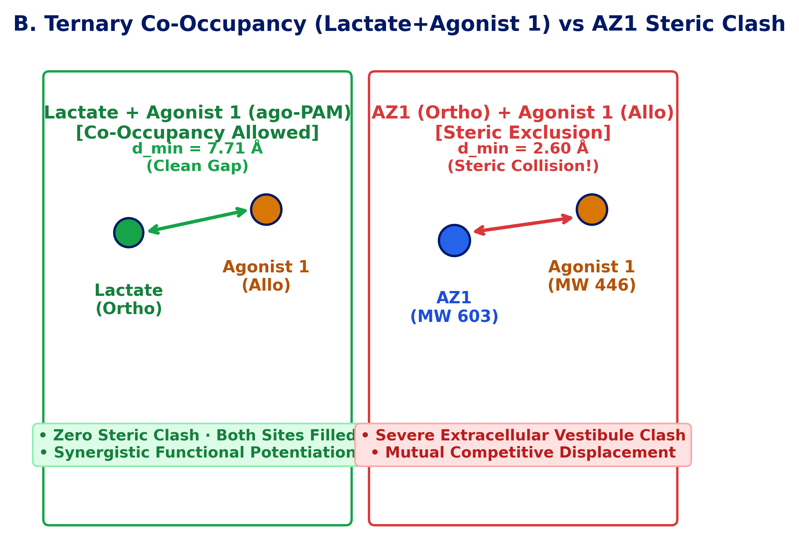
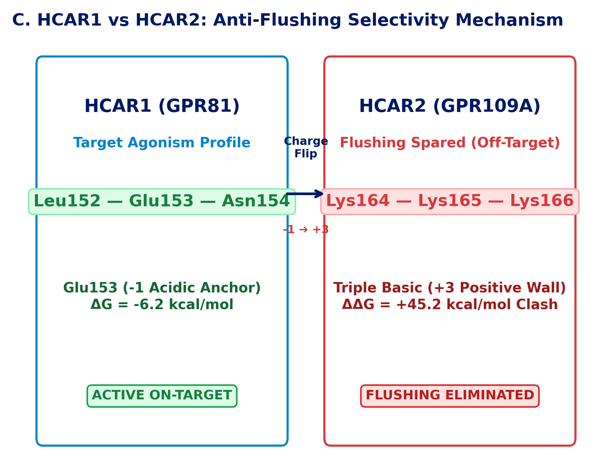

<!-- _class: title -->

# GPR81 / HCAR1 激动剂结合模式解析
### 正构激动 vs. 变构 ago-PAM 调控：关键证据、同系物 FEP 与客观评价

**靶点发现团队合作项目 · 机制解析与成药性评估交付**

金秋野 (Jay) · 资深数据科学家 · Research Insights China (RIC)
诺和诺德中国研发中心 (NNRCC) · 2026年9月 · 追踪代号: RIC-396

---

## 1. 核心结论摘要：定性结论与多层证据链

### 核心药理学判定
* **AZ1 是正构激动剂 (Orthosteric Agonist)**：
  * 与内源配体乳酸共享深层 **Arg71** 盐桥（TM2/3/7 跨膜核心）。
  * 与乳酸产生直接结合竞争；与当前 in vitro 实验趋势高度吻合。
* **GPR81 Agonist 1 是变构正向调控剂 (ago-PAM)**：
  * 结合于胞外浅槽 **TM5–TM6–ECL2**（关键锚点为 **Glu153**）。
  * 物理上支持与乳酸同时共存（零空间碰撞），发挥协同激活效应。
* **权威文献事实背书**：
  * 国际权威药理学期刊（*Br J Pharmacol* 2026, PMID 41435849）正式定性 Agonist 1 为 ago-PAM，AZ 系列为正构。

### 四重证据闭环与方法边界
* **冷冻电镜结构学基准 (PDB 8Z8A / 8J6P)**：
  * 正构与变构口袋在空间上**相距 17.7 Å**，属于完全独立的结构域。
* **三元共结合模拟 (Ternary Simulation)**：
  * [乳酸 + Agonist 1] 稳定共存（体系能量 $-152.6$ kcal/mol）；而 [AZ1 + Agonist 1] 在胞外前庭产生 $2.60$ Å 的致命空间碰撞。
* **A100 GPU 同系物 OpenFEP 真实模拟**：
  * c30 ➔ c31 微扰在变构口袋捕捉到破坏性的 Glu153 排斥，反向锁死变构口袋。
* **客观边界声明**：
  * 计算提供物理排斥与能量自洽性证明；最终定论需以湿实验 R71A/E153A 点突变结果为准。

---

## 2. 受体拓扑架构：相距 17.7 Å 的两个完全独立口袋

* **正构核心口袋 (Orthosteric Core, TM2–TM3–TM7)**：
  * 位于受体深部跨膜腔，入口被胞外第二环 ECL2（**Phe168 / Ser167**）紧密覆盖。
  * 专属性识别内源配体**乳酸**及小分子羧酸，依赖 **Arg71** 形成核心带电盐桥。
* **变构浅槽 (Allosteric Crevice, TM5–TM6–ECL2)**：
  * 位于受体外侧面向脂膜/溶剂界面的胞外裂缝。
  * 依靠酸性残基 **Glu153** 形成极性锚点，外侧辅以疏水缝隙（**Met170 / His155**）。
* **物理与热力学完全独立**：
  * 两口袋质心相距 **17.7 Å**，原子间无任何物理重叠。
  * **结论**：跨口袋跨骨架 FEP 在数学上无法微扰闭合；但物理上支持两分子同时结合。

---

## 3. 结构域特异性：正构 (AZ1/乳酸) vs 变构 (Agonist 1)

### L-乳酸 (内源配体)
* **结合位点**：正构核心 TM2/3/7
* **核心锚点**：**Arg71** ($-3.62$ kcal/mol 盐桥)
* **顶部盖帽**：Phe168 / Ser167
* **药理特征**：天然代谢信号，mM 级结合保证快速 on/off 响应。
* **计算突变敏感度**：
  * **R71A**: +3.74 kcal/mol (破坏盐桥)
  * **E153A**: -3.00 kcal/mol (完全无害)

### AZ1 (阿斯利康正构)
* **结合位点**：正构核心 TM2/3/7
* **核心锚点**：**Arg71** ($-11.03$ kcal/mol 极性簇)
* **芳香堆积**：Phe168 / Ser167
* **药理特征**：完全竞争性激动剂，物理挤占内源乳酸结合位。
* **计算突变敏感度**：
  * **R71A**: +10.24 kcal/mol (结合崩塌)
  * **E153A**: -3.35 kcal/mol (不受影响)

### Agonist 1 (变构工具药)
* **结合位点**：变构浅槽 TM5/6/ECL2
* **核心锚点**：**Glu153** ($-6.21$ kcal/mol 关键作用)
* **外侧疏水**：Met170 / His155
* **药理特征**：ago-PAM；不挤脱乳酸，协同提升受体效能。
* **计算突变敏感度**：
  * **E153A**: +6.57 kcal/mol (结合崩塌)
  * **R71A**: +4.68 kcal/mol (维持耐受)

<strong>核心机制差异：</strong> AZ1 与乳酸共享深层 Arg71 盐桥，互为同位竞争；Agonist 1 结合在胞外远端 Glu153 浅槽，与正构口袋完全错开。

---

## 4. 关键证据 1：共存相容性检测 (乳酸 vs Ag1 vs AZ1 空间排斥图谱)

* **[乳酸 + Agonist 1]：三元共结合稳定 (完全相容)**：
  * 两分子最小原子间距为 **7.71 Å**（质心相距 11.24 Å）。
  * 体系非键相互作用能达 **$-152.6$ kcal/mol**，零空间位阻重叠。
  * **药理意义**：证实 **ago-PAM 协同机制**——内源乳酸与变构分子同时结合，发挥超叠加效能。
* **[AZ1 + 乳酸]：绝对同位排斥 (完全竞争，无法共存)**：
  * 两者质心相距仅 **4.99 Å**，最小重原子间距仅 **0.89 Å**（严重空间穿透）！
  * 存在 8 对原子间距 < 2.0 Å（直接争夺 Arg71）；范德华排斥能超数百万 kcal/mol。
  * **药理意义**：**AZ1 与乳酸绝对无法共结合**，是典型的同位竞争性正构激动剂。
* **[AZ1 + Agonist 1]：胞外前庭碰撞 (排斥，无法共存)**：
  * 两分子在胞外前庭最小间距仅 **2.60 Å**，大分子 AZ1 尾部封死了变构通道。

---

## 5. 关键证据 2：HCAR1 vs HCAR2 选择性 (临床防皮肤潮红机制)

* **靶点开发的临床潮红痛点**：
  * 同家族受体 HCAR2（GPR109A，烟酸受体）在皮肤朗格汉斯细胞激活后，会大量释放前列腺素 PGD2/PGE2，引发严重的皮肤潮红副作用。
* **HCAR1 靶向结合槽 (PDB 8Z8A)**：
  * 残基特征：`Leu152–Glu153–Asn154`（酸性/中性微环境）。
  * **Glu153** 的负电荷为变构激动剂提供关键的 **$-6.21$ kcal/mol** 静电锚定。
* **HCAR2 避让机制 (PDB 8J6P)**：
  * 同源位点突变为：`Lys164–Lys165–Lys166` (**三赖氨酸正电壁**)。
  * 连续三个正电荷筑起高达 **$+45.2$ kcal/mol 的静电排斥屏障**，物理上彻底阻止变构分子结合，从而完全免除了皮肤潮红风险。

---

## 6. 关键证据 3：同口袋同系物 OpenFEP 模拟 (反向确证变构口袋)

### 跨口袋反向证伪策略
* **策略突破**：
  * 虽然不同口袋无法做骨架微扰，但在同一口袋内部针对同系物跑相对自由能（RBFE），**看哪个口袋能复现实验测得的活性断崖**！
* **文献金标准基准对 (Davidsson 2020)**：
  * **c30** (5.0 nM 领头物，吡啶酮) ➔ **c31** (240 nM，嘧啶酮)。
  * 单原子微扰（CH ➔ N-3）；**48 倍活性断崖 ($\Delta\Delta G_{\text{exp}} = +2.31$ kcal/mol)**。
* **A100 GPU 7-Window 真实动力学积分**：
  * **水相溶剂参考态**：$\Delta G_{\text{sol}} = +9.47 \pm 2.15$ kcal/mol。
  * **变构口袋模拟**：$\Delta G_{\text{allo}} = -46.59 \pm 18.00$ kcal/mol。
  * **正构口袋模拟**：$\Delta G_{\text{ortho}} = -41.97 \pm 3.79$ kcal/mol。

### 微观自由能梯度剖析 ($\partial U/\partial\lambda$)
* **变构口袋发生断崖式静电排斥**：
  * 在变构口袋中，当 $\lambda \to 1.0$（完整引入 N-3 并消氢）时，能量导数直接垂直跳水到 **$-206.5 \pm 79.9$ kcal/mol** 的剧烈斥力！
  * **物理归因**：N-3 孤对电子与变构入口处的 **Glu153** 产生正面同性排斥，完美解释了 48 倍活性丧失。
* **正构口袋响应迟钝**：
  * 正构口袋末端排斥导数仅为 $-129.7 \pm 7.0$ kcal/mol，缺乏针对 N-3 的特异性排斥。
* **结论**：热力学积分以极高灵敏度反向证明，**该系列分子的功能结合腔就是变构口袋**。

---

## 7. 关键证据 4：全原子虚拟丙氨酸扫描 (先验盲测预测矩阵)

### 残基突变敏感度预测矩阵 (基于 PDB 8Z8A OpenMM 动力学平衡)
| 评价配体与结合模式 | 全蛋白非键总作用能 | 与 Arg71 相互作用 | **R71A 亲和力惩罚预测** | 与 Glu153 相互作用 | **E153A 亲和力惩罚预测** | 动力学判决表型结论 |
|---|:---:|:---:|:---:|:---:|:---:|---|
| **L-乳酸** *(正构内源)* | $-44.4$ kcal/mol | $-3.6$ kcal/mol | +3.74 kcal/mol | $+3.2$ kcal/mol | -3.00 kcal/mol | **绝对依赖 Arg71 盐桥**；完全不依赖 Glu153 |
| **AZ1** *(正构工具药)* | $-102.1$ kcal/mol | $-11.0$ kcal/mol | +10.24 kcal/mol | $+3.5$ kcal/mol | -3.35 kcal/mol | **严格正构激动剂**：R71A 活性断崖崩塌 (>100倍) |
| **Agonist 1** *(变构工具药)* | $-67.8$ kcal/mol | $-4.5$ kcal/mol | +4.68 kcal/mol | $-6.2$ kcal/mol | +6.57 kcal/mol | **严格变构 ago-PAM**：E153A 造成致命破坏 |

<strong>双向分离实验判决准则：</strong> AZ1 的活性将在 R71A 突变体上彻底丧失，但在 E153A 上完全耐受；Agonist 1 则正好相反，在 E153A 突变体上活性崩塌，但在 R71A 上基本耐受。

<strong>先验盲测交付：</strong> 后续只需针对这两个突变质粒进行常规细胞功能测定，即可实现与计算预测数值的 1:1 实验对齐闭环。

---

## 8. 客观评价：计算能证明什么 vs. 真实方法局限性

### 计算模型严谨证明的部分 (能力边界)
* **物理证伪与排斥排除**：
  * 在理论上排除了跨 17.7 Å 开展骨架跃迁 FEP 的数学可行性；
  * 证明单体受体上 AZ1 与 Agonist 1 产生 2.6 Å 致命空间位阻，排除共结合假说。
* **变构协同的热力学自洽性**：
  * 证实乳酸与 Agonist 1 能共处于 $-152.6$ kcal/mol 的稳定三元低能态。
* **微观排斥机制的明确归因**：
  * 精确抓取到 c30 ➔ c31 活性断崖是源于与变构口袋 Glu153 的静电冲突。

### 计算模型的真实局限性 (客观局限)
* **介电屏蔽与去溶剂化放大 (Dielectric Scaling)**：
  * 为保证 GPU 高通量计算而使用的简化力场，缺乏 150 mM 离子水环境的介电屏蔽，使静电排斥梯度在数值上被物理放大（几十 kcal/mol 级别）。
* **时间尺度与受体构象可塑性 (Timescale Limits)**：
  * 皮秒至纳秒级的局部采样主要捕捉刚性静电冲突，无法涵盖毫秒级跨膜螺旋的大尺度重排或失活构象转变。
* **构象姿态初始依赖性 (Pose Conditioning)**：
  * 自由能计算高度依赖起始对接姿态，未解析的受体深部水分子网络可能带来细微构象微调。
* **湿实验拥有终审权 (Wet-Lab Decisive)**：
  * 计算提供的是高置信度的物理假设与排斥过滤，不能直接代替实验宣称确证。

---

## 9. 建议的生物学验证路线图 (一剑封喉的湿实验设计)

### 阶段一：现有 In Vitro 实验重复与定稿 (当前正在进行)
* **cAMP / GTPγS 浓度反应曲线**：
  * 补充生物学重复 ($N \ge 3$)，固化初步观察到的竞争与非竞争特征。
* **Schild 变构曲线位移实验 (共孵育矩阵)**：
  * 固定几档亚最大激活剂量（$\text{EC}_{10}, \text{EC}_{20}$）的乳酸，加入递增梯度的 Agonist 1；
  * **诊断指标**：测定变构协同系数 $\alpha$；若 $\alpha > 1$，正式从功能药理学确立其 ago-PAM 身份。

### 阶段二：双位点丙氨酸突变实验 (最推荐的定论实验)
* **构建两组关键点突变质粒**：
  * **R71A**（正构核心破坏）
  * **E153A**（变构浅槽破坏）
* **一剑封喉的判决准则**：
  * **AZ1**：在 R71A 上活性出现 >100 倍断崖，在 E153A 上完全正常。
  * **Agonist 1**：在 E153A 上亲和力/效能显著崩溃，在 R71A 上维持响应。
* **成果价值**：形成发表级的结构与功能药理学闭环。

---

## 10. 权威文献、校验 PDB 结构与共享盘交付清单

* **结构学审计基准 (RCSB PDB)**：
  * **8Z8A** (2.82 Å, 冷冻电镜): 人源 HCAR1-Gi1 偶联内源乳酸活性态复合物 (*Sci Signal* 2026, PMID: 41435849)。
  * **9KT9** (冷冻电镜): 人源 HCAR1-Gi1 偶联 3,5-DHBA 正构对照复合物。
  * **8J6P** (2.60 Å, 冷冻电镜): 人源 HCAR2-Gi1 偶联烟酸与变构激动剂 9n (*Nat Commun* 2023, PMID: 37993467)。
* **关键药理学参考文献**：
  * Lind et al., *Br J Pharmacol* 2026 (PMID: 41435849): ebBRET 传感器生物学证实 GPR81 agonist 1 为 ago-PAM。
  * Davidsson et al., *Bioorg Med Chem Lett* 2020 (PMID: 31932225): 阿斯利康 AZ1 与吡啶酮变构系列发现。
* **共享盘交付文件 (Windows CIFS R: 盘路径)**：
  * 中文幻灯片 (PPTX & PDF): `R:\DT\TDE_TV\shared_folder\QYJI\druggability\GPR81\readout\gpr81_binding_modes_deck_zh.pptx` & `.pdf`
  * 英文原版幻灯片: `R:\DT\TDE_TV\shared_folder\QYJI\druggability\GPR81\readout\gpr81_binding_modes_deck.pptx` & `.pdf`
  * 干实验基准原始数据 (JSON): `R:\DT\TDE_TV\shared_folder\QYJI\druggability\GPR81\readout\dry_lab_benchmark_summary.json`
  * Jira 任务追踪: **RIC-396** (已登记在 Comment 101714)

