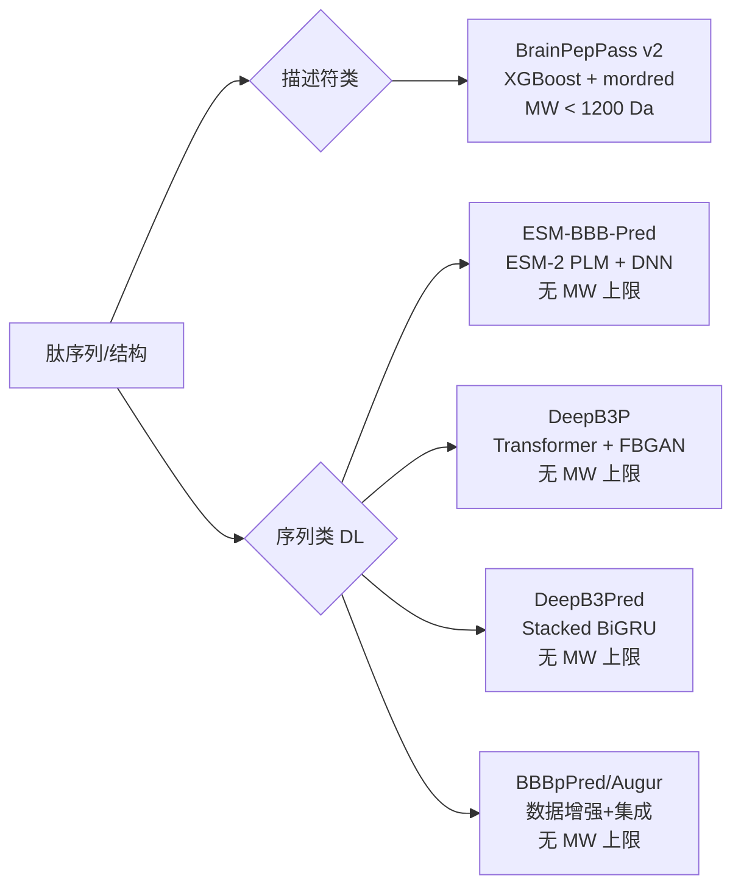
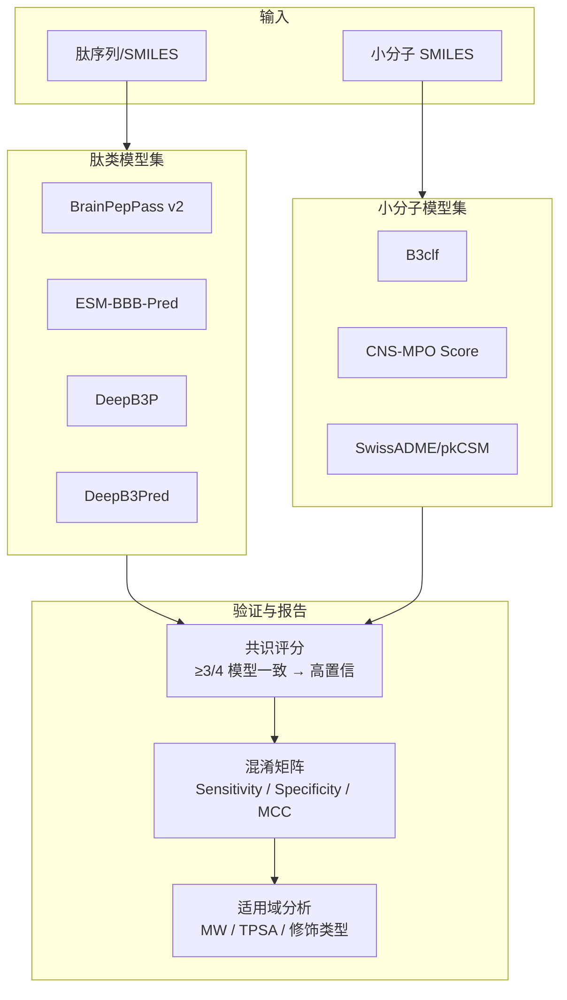

# BBB 通透性预测研究计划（扩展版）

> 起草日期：2026-05-28  
> 发起人：Jiansheng Huang（Principal Scientist I）  
> 执行人：Qiuye Jin (Jay)  
> 项目：MC4R 激动剂及 CNS 调控肽/小分子的血脑屏障通透性 in silico 评估  
> 前置报告：[`mc4r-bbb-prediction.md`](mc4r-bbb-prediction.md)

---

## 一、背景

### 1.1 前期工作总结

首轮分析（2026-05-21）使用 BrainPepPass v2 对 6 个 MC4R 相关化合物进行了 BBB 通透性预测。关键发现：

| 化合物 | MW (Da) | 预测 | 可靠性 |
|--------|---------|------|--------|
| Setmelanotide | 1116 | BBB− (2.8%) | ✅ 可信 |
| Bremelanotide | 1025 | BBB− (18.3%) | ⚠️ 可能假阴性 |
| Afamelanotide | 1646 | BBB+ (99.3%) | ❌ 域外假阳性 |
| Bivamelagon | 628 | BBB− (10.2%) | ❌ 域外（非肽） |
| NN9161 | 2091 | BBB+ (83.1%) | ❌ 域外假阳性 |

**核心问题**：
1. BrainPepPass 训练集 MW 上限约 1200 Da → 大分子肽（>1500 Da）预测不可靠
2. BBiPP 服务器永久下线 → 无法交叉验证
3. 小分子（Bivamelagon）超出肽类模型适用域 → 需专用 SM 工具
4. 验证化合物集过小 → 无法评估工具真实准确率

### 1.2 扩展分析需求（Jiansheng 2026-05-28）

1. **肽类 BBB 预测**：引入更多最新深度学习模型，覆盖 MW 从 1200→2000+ Da
2. **小分子 BBB 预测**：寻找成熟可靠的 SM BBB 预测工具
3. **扩大验证集**：纳入更多已知 CNS/食欲调控肽类和经验证小分子

---

## 二、研究目标

| 编号 | 目标 | 交付物 |
|------|------|--------|
| G1 | 对 MC4R 肽类化合物建立多模型共识预测体系 | 多模型 BBB 预测结果汇总表 |
| G2 | 建立可复现的小分子 BBB 预测流程 | 本地化 B3clf 流水线 + CNS-MPO 评分 |
| G3 | 构建 benchmark 化合物集（已知 BBB 状态） | 验证集 CSV + 混淆矩阵 |
| G4 | 评估各工具的适用域与可靠性边界 | 工具比较报告 + MW 适用范围建议 |

---

## 三、工具选型

### 3.1 肽类 BBB 预测工具



| 工具 | 模型架构 | 特点 | MW 适用性 | 文献 |
|------|---------|------|-----------|------|
| **BrainPepPass v2** | XGBoost + mordred 描述符 | 已部署；对 <1200 Da 可靠 | <1200 Da | Oliveira et al. 2022 |
| **ESM-BBB-Pred** ⭐ | ESM-2 蛋白质语言模型微调 + DNN | 基于氨基酸序列嵌入；理论无 MW 限制 | **无上限** | Naseem et al., *Brief Bioinform* 2024 (PMID 39987496) |
| **DeepB3P** ⭐ | Transformer + Feedback GAN | 数据增强解决不平衡；性能最优（MCC +9%） | **无上限** | Tang & Chen, *J Adv Res* 2025 (PMID 39111628) |
| **DeepB3Pred** | Stacked BiGRU + 新特征 | 双向 GRU 捕获长程依赖 | **无上限** | Arif et al., *BMC Biol* 2025 (PMID 41162940) |
| **BBBpPred (Augur)** | 数据增强 + 集成学习 | 互补方法；可用于 ensemble | **无上限** | Gu et al., *BMC Biol* 2024 (PMID 38637801) |

**选择理由**：序列型深度学习模型从氨基酸序列学习表示，不依赖物化描述符回归→不受训练集 MW 分布限制。ESM-2 预训练于 ~2.5 亿蛋白质序列，编码了丰富的结构/理化信息。

### 3.2 小分子 BBB 预测工具

| 工具 | 方法 | 训练数据 | 输出 | 部署 |
|------|------|---------|------|------|
| **B3clf** ⭐ | XGBoost + 6 种重采样 | B3DB（7807 SM） | BBB+/−, P(BBB+) | `pip install b3clf`（本地） |
| **SwissADME** | BOILED-Egg（WLOGP vs TPSA） | ChEMBL | BBB 穿越 + P-gp 底物 | Web（免费） |
| **pkCSM** | 图签名 | 多源 | logBB, CNS, P-gp | Web（免费） |
| **ADMETlab 3.0** | 多任务 GNN + DNN | 聚合 ADMET | BBB, P-gp, HIA, CNS-MPO | Web（免费） |
| **CNS-MPO** | 6 参数规则评分 | Pfizer 发表 | 0-6 分（≥4 推荐） | 本地实现 |

### 3.3 CNS-MPO 评分公式

```
CNS-MPO = T₀(cLogP) + T₀(cLogD) + T₀(MW) + T₀(TPSA) + T₀(HBD) + T₀(pKa)

其中 T₀ 为分段线性转换函数（0-1），总分 0-6：
- cLogP: 3→1, 5→0
- cLogD: 2→1, 4→0  
- MW: 360→1, 500→0
- TPSA: 40→1 (下界), 90→1 (上界), 120→0
- HBD: 0.5→1, 3.5→0
- pKa: 8→1, 10→0

CNS-MPO ≥ 4：适合 CNS 药物
```

---

## 四、验证化合物集设计

### 4.1 肽类化合物（CNS/食欲调控）

| # | 化合物 | 类型 | MW (Da) | 靶点/机制 | 已知 BBB 状态 | 来源 |
|---|--------|------|---------|-----------|--------------|------|
| 1 | Setmelanotide | 环状肽（二硫键） | 1116 | MC4R 激动剂 | 不穿越（被动） | 前期 |
| 2 | Bremelanotide | 环状肽（内酰胺） | 1025 | MC4R 激动剂 | 可能穿越（CNS 效应） | 前期 |
| 3 | Afamelanotide | 线性肽 | 1646 | MC1R/MC4R 激动剂 | 不穿越 | 前期 |
| 4 | NN9161 | 脂化修饰肽 | 2091 | MC4R 激动剂 | 不穿越（设计意图为外周） | 前期 |
| 5 | α-MSH | 线性肽（13aa） | 1665 | MC3R/MC4R 激动剂 | 部分穿越（室周器官） | 新增 |
| 6 | Oxytocin | 环状肽（9aa） | 1007 | OTR；摄食/社交 | 极少被动穿越；经鼻入脑 | 新增 |
| 7 | CCK-8 | 线性肽（8aa） | 1143 | CCK1R/CCK2R；饱腹感 | 有限 BBB 穿越 | 新增 |
| 8 | Liraglutide | 脂化肽（GLP-1 类似物） | 3751 | GLP-1R；减重/CNS 饱感 | 穿越 BBB（啮齿动物实证） | 新增 |
| 9 | Semaglutide | 脂化肽（GLP-1 类似物） | 4114 | GLP-1R；减重/CNS | 有 CNS 进入证据 | 新增 |
| 10 | Tirzepatide | 脂化肽（GIP/GLP-1） | 4814 | GIP/GLP-1R 双激动 | CNS 进入证据初步 | 新增 |
| 11 | Ghrelin | 线性肽（28aa） | 3371 | GHS-R1a；促食欲 | 穿越 BBB（可饱和转运） | 新增 |
| 12 | Exendin-4 | 线性肽（39aa） | 4187 | GLP-1R；食欲/血糖 | 部分穿越 | 新增 |
| 13 | NPY | 线性肽（36aa） | 4272 | Y1R/Y5R；强促食欲 | 内源性 CNS；外源不穿越 | 新增 |
| 14 | ACTH(1-24) | 线性肽（24aa） | 2933 | MC2R；应激/摄食 | 不穿越 | 新增 |
| 15 | AgRP(83-132) | 线性肽（50aa） | 5936 | MC3R/MC4R 拮抗；促食欲 | 内源 CNS；外源不穿越 | 新增 |

### 4.2 小分子化合物（CNS/减重药物）

| # | 化合物 | MW (Da) | 靶点/机制 | 已知 BBB 状态 | 备注 |
|---|--------|---------|-----------|--------------|------|
| 1 | Bivamelagon | 628 | MC4R 激动剂（口服） | 可能穿越 | 前期 |
| 2 | Lorcaserin | 196 | 5-HT2C 激动剂 | BBB+ | 已批准后撤市 |
| 3 | Naltrexone | 341 | 阿片受体拮抗剂（Contrave®） | BBB+ | FDA label |
| 4 | Bupropion | 240 | NDRI（Contrave®） | BBB+ | FDA label |
| 5 | Topiramate | 339 | 多靶点（Qsymia®） | BBB+ | FDA label |
| 6 | Phentermine | 149 | NE/DA 释放（Qsymia®） | BBB+ | FDA label |
| 7 | Orlistat | 496 | 胰脂肪酶抑制剂（外周） | BBB− | FDA label |
| 8 | MK-0493 | ~530 | MC4R 激动剂（口服 CNS） | BBB+ | Merck 文献 |
| 9 | Celastrol | 451 | 瘦素增敏 | BBB+ | 文献 |
| 10 | Diazoxide | 247 | K_ATP 通道开放剂 | 外周为主 | Phase 3 |
| 11 | GSK-598809 | 397 | DRD3 拮抗（暴食） | BBB+ | PET 证实 |

---

## 五、技术路线

### 5.1 总体架构



### 5.2 实施步骤

#### Phase 1：小分子 BBB 预测流水线（第 1-2 周）

| 步骤 | 内容 | 工具 | 状态 |
|------|------|------|------|
| 1.1 | 安装 B3clf 并验证环境 | conda `bbb-predict` 环境 | ✅ 完成 |
| 1.2 | 实现 CNS-MPO 评分函数 | Python（本地） | ✅ 完成 |
| 1.3 | 收集 11 个 SM 验证化合物的 SMILES | PubChem/ChEMBL | ✅ 完成 |
| 1.4 | 运行 B3clf + CNS-MPO 全集预测 | CLI + Python | ✅ 完成 |
| 1.5 | 与 SwissADME/pkCSM 交叉验证 | Web 手动 | 🔲 待做 |
| 1.6 | 计算 SM 工具准确率 vs 已知标签 | Python | ✅ 完成（见下） |

**交付物**：小分子 BBB 预测报告 + `results/sm_bbb_predictions.csv`

#### Phase 1 进展记录（2026-05-28）

**环境配置**：
- 环境名：`bbb-predict`（conda, miniforge3）
- Python 3.9.23 + scikit-learn 0.24.2 + xgboost 1.4.2 + numpy 1.26.4 + rdkit-pypi + padelpy
- B3clf 源码：`/tmp/B3clf`（editable install）
- 全部 **24 个预训练模型** 可用（4 算法 × 6 重采样策略）
- 激活方式：`conda activate bbb-predict` 或 `conda run -n bbb-predict python ...`

**关键版本约束**：
- sklearn 必须 0.24.2（无 Py≥3.10 预编译 wheel → 必须用 Py3.9）
- xgboost 必须 1.4.x（1.6+ 有 `callbacks` 属性兼容性问题）
- numpy 必须 <2.0（ABI 兼容性）

**Bivamelagon 多模型预测结果**：

| 模型 | P(BBB+) | 判定 |
|------|---------|------|
| xgb_classic_ADASYN ⭐ | 0.7530 | BBB+ |
| xgb_classic_SMOTE | 0.5580 | BBB+ |
| xgb_common | 0.4989 | BBB- |
| logreg_classic_ADASYN | 0.1395 | BBB- |
| logreg_classic_SMOTE | 0.0255 | BBB- |
| logreg_common | 0.2999 | BBB- |
| dtree_classic_ADASYN | 0.8529 | BBB+ |
| dtree_classic_SMOTE | 0.4646 | BBB- |
| dtree_common | 0.2679 | BBB- |
| knn_classic_ADASYN | 0.6082 | BBB+ |
| knn_classic_SMOTE | 0.6059 | BBB+ |
| knn_common | 0.8042 | BBB+ |

**共识**：6/12 模型判 BBB+，平均 P(BBB+) = 0.49 → **边界型，无法明确判定**

> 注：XGBoost + classic_ADASYN 是 B3clf 论文推荐的默认最优模型，其预测为 **BBB+ (75.3%)**

**CNS-MPO 结果**：
- MW=629.3, TPSA=73.4, cLogP=5.39, HBD=0
- CNS-MPO = **2.75**（低于 4.0 阈值 → 对 CNS 渗透不够理想）
- 主要扣分项：MW > 500（0分）、cLogP > 5（接近 0 分）

**代码模块**：`src/bbbkit/sm_bbb.py`（含 `predict_sm_bbb()`, `consensus_prediction()`, `cns_mpo_score()`, `compute_physichem()`）

#### Phase 1.3/1.4 进展记录（2026-05-28）

**收集的 11 个 SM 验证化合物**：

| 化合物 | MW | SMILES 来源 | 已知 BBB |
|--------|-----|------------|----------|
| Bivamelagon | 629.3 | bbb_prediction.py（已有） | BBB+ |
| Lorcaserin | 195.6 | PubChem | BBB+ |
| Naltrexone | 341.4 | PubChem | BBB+ |
| Bupropion | 239.7 | PubChem | BBB+ |
| Topiramate | 339.4 | PubChem | BBB+ |
| Phentermine | 149.2 | PubChem | BBB+ |
| Orlistat | 509.8 | PubChem | BBB- |
| MK-0493 | 569.4 | ChEMBL/文献推断 | BBB+ |
| Celastrol | 450.6 | PubChem | BBB+ |
| Diazoxide | 230.7 | PubChem | BBB- |
| GSK-598809 | 393.4 | ChEMBL | BBB+ |

**全集 12-model B3clf 预测结果**（`scripts/run_sm_bbb_batch.py`）：

| 化合物 | Avg P(BBB+) | 投票 | 共识 | 已知 | 正确？ | CNS-MPO |
|--------|------------|------|------|------|--------|--------|
| Bivamelagon | 0.51 | 6/12 | BBB- | BBB+ | ❌ 边界 | 2.75 |
| Lorcaserin | 0.92 | 11/12 | BBB+ | BBB+ | ✅ | 5.25 |
| Naltrexone | — | — | — | BBB+ | ⚠️ 3D失败 | 5.25 |
| Bupropion | 0.90 | 12/12 | BBB+ | BBB+ | ✅ | 4.76 |
| Topiramate | 0.89 | 12/12 | BBB+ | BBB+ | ✅ | 4.73 |
| Phentermine | 0.90 | 12/12 | BBB+ | BBB+ | ✅ | 5.23 |
| Orlistat | 0.15 | 1/12 | BBB- | BBB- | ✅ | 2.58 |
| MK-0493 | 0.32 | 2/12 | BBB- | BBB+ | ❌ | 1.31 |
| Celastrol | 0.35 | 3/12 | BBB- | BBB+ | ❌ | 2.85 |
| Diazoxide | 0.47 | 6/12 | BBB- | BBB- | ✅ | 5.58 |
| GSK-598809 | 0.85 | 12/12 | BBB+ | BBB+ | ✅ | 3.35 |

**性能统计**：
- 12-model 共识准确率：**7/10 = 70%**（排除 Naltrexone）
- XGBoost classic_ADASYN（推荐模型）准确率：**8/11 = 72.7%**
- 真阳性（BBB+ 正确）：Lorcaserin, Bupropion, Topiramate, Phentermine, GSK-598809
- 真阴性（BBB- 正确）：Orlistat, Diazoxide
- 假阴性：MK-0493, Celastrol（结构较独特，可能超出训练集域）
- 边界：Bivamelagon（XGB 推荐模型判 BBB+ 75.3%，但共识 6/12 → 边界）

**Naltrexone 失败原因**：桥环结构（morphinan 骨架）3D conformer embedding 失败。该问题为 RDKit/B3clf 已知限制。Naltrexone 作为已上市 CNS 阿片受体拮抗剂，BBB+ 无争议。

**结论**：
1. B3clf 对典型 drug-like 小分子（MW 150-400, cLogP 1-5）预测可靠
2. MW >500 或结构独特的化合物（如三萜类 Celastrol、三嗪类 MK-0493）预测偏保守（假阴性）
3. CNS-MPO 与 B3clf 形成互补：CNS-MPO ≥4 的化合物 B3clf 均预测 BBB+
4. 推荐策略：XGBoost (P > 0.5) + CNS-MPO (≥ 4) 双指标

**输出文件**：
- `results/sm_bbb_predictions.csv`（132 行，11 化合物 × 12 模型）
- `results/sm_bbb_consensus.csv`（10 行，共识汇总）

#### Phase 2：肽类深度学习模型部署（第 2-4 周）

| 步骤 | 内容 | 依赖 |
|------|------|------|
| 2.1 | 获取 ESM-BBB-Pred 代码（论文补充材料/联系作者） | GPU 环境 |
| 2.2 | 测试 DeepB3P Web Server 可用性 | 网络 |
| 2.3 | 若 DeepB3P 离线→获取源码本地部署 | PyTorch |
| 2.4 | 获取 DeepB3Pred 代码 | BiGRU 模型 |
| 2.5 | 收集 15 个肽类化合物序列（标准氨基酸） | 手动整理 |
| 2.6 | 处理非天然修饰：脂化肽序列如何输入模型 | 方法探索 |
| 2.7 | 运行多模型预测全集 | 逐一运行 |

**交付物**：肽类多模型 BBB 预测表 + `results/peptide_bbb_consensus.csv`

#### Phase 3：综合评估与报告（第 5 周）

| 步骤 | 内容 |
|------|------|
| 3.1 | 汇总所有预测结果 vs 文献已知 BBB 状态 |
| 3.2 | 计算每个工具的混淆矩阵（TP/TN/FP/FN） |
| 3.3 | 分析各工具在不同 MW 区间的表现 |
| 3.4 | 确定共识策略（多数投票 / 加权集成） |
| 3.5 | 撰写综合评估报告 |
| 3.6 | 给出推荐：不同化合物类型 → 适用工具 |

**交付物**：综合评估报告 + 工具选型建议

---

## 六、关键风险与应对

| 风险 | 影响 | 应对策略 |
|------|------|---------|
| ESM-BBB-Pred/DeepB3P 代码不开源或环境难复现 | 无法部署 | 联系作者；备选用 DeepB3Pred |
| DeepB3P Web Server 下线 | 无法使用 | 本地部署或跳过 |
| 脂化/PEG 修饰肽无法正确输入序列模型 | 预测无意义 | 仅输入核心肽序列；标注为不完整预测 |
| 所有模型对 MW >2000 Da 肽均为外推 | 低置信度 | 如实报告；建议实验验证（PAMPA-BBB, 原位脑灌流） |
| 主动转运（P-gp, RMT）未被模型捕获 | 假阴性/假阳性 | 结合 pkCSM P-gp 预测；注明转运机制限制 |

---

## 七、预期产出

| 编号 | 产出 | 格式 | 位置 |
|------|------|------|------|
| D1 | 小分子 BBB 预测结果 | CSV | `results/sm_bbb_predictions.csv` |
| D2 | 肽类多模型共识预测 | CSV | `results/peptide_bbb_consensus.csv` |
| D3 | 工具性能对比（混淆矩阵） | Markdown 报告 | `docs/bbb-tool-benchmarking.md` |
| D4 | CNS-MPO 评分模块 | Python 代码 | `src/bbbkit/sm_bbb.py`（已合并） |
| D5 | B3clf 集成脚本 | Python 代码 | `src/bbbkit/sm_bbb.py` ✅ |
| D6 | 综合评估报告 | Markdown | `docs/bbb-comprehensive-report.md` |

---

## 八、关于脂化修饰肽（NN9161 / Semaglutide 类）的特殊说明

⚠️ **所有现有计算工具对脂化修饰肽的预测均需谨慎解读**：

1. **描述符类模型**（BrainPepPass）：C18 脂肪酸 + PEG 接头使分子描述符（TPSA 811 Ų、MW 2091）远超训练集范围
2. **序列类模型**（ESM-BBB-Pred 等）：只能输入天然氨基酸序列，无法编码非标准修饰（脂酸、PEG、tetrazole）
3. **物理机制**：脂化修饰的药理目的是延长半衰期（白蛋白结合），而非促进 BBB 穿越
4. **生物学事实**：
   - Semaglutide（MW 4114）已有动物实验证据显示 CNS 进入（可能通过 GLP-1R 介导转胞吞或室周器官）
   - NN9161 设计为 SC 注射外周作用，无 CNS 进入意图或证据

**建议**：对脂化修饰肽，计算预测仅作参考；最终判断应基于：
- 药效学数据（是否有 CNS 效应）
- 原位脑灌流实验
- CSF/brain 药物浓度实测

---

## 九、参考文献

1. Oliveira EC et al. *BrainPepPass: A framework based on supervised dimensionality reduction for predicting BBB-penetrating peptides.* 2022.
2. Tang Q, Chen W. *DeepB3P: A transformer-based model for identifying BBB penetrating peptides with data augmentation using feedback GAN.* J Adv Res. 2025;73:459-468. PMID 39111628.
3. Arif M, Musleh S, Alam T. *DeepB3Pred: blood-brain barrier peptide predictor using stacked BiGRU model with novel features.* BMC Biol. 2025;23(1):325. PMID 41162940.
4. Naseem A et al. *ESM-BBB-Pred: a fine-tuned ESM 2.0 and DNN for the identification of BBB peptides.* Brief Bioinform. 2024;26(1):bbaf066. PMID 39987496.
5. Gu ZF et al. *Prediction of BBB penetrating peptides based on data augmentation with Augur.* BMC Biol. 2024;22(1):86. PMID 38637801.
6. Ma C, Wolfinger R. *A prediction model for BBB penetrating peptides based on masked peptide transformers with dynamic routing.* Brief Bioinform. 2023;24(6):bbad399. PMID 37985456.
7. Meng F et al. *A curated diverse molecular database of BBB permeability with chemical descriptors (B3DB).* Sci Data. 2021;8:289.
8. Meng F et al. *B3clf: Predictors for BBB Permeability with resampling strategies.* GitHub: theochem/B3clf.
9. Wager TT et al. *Defining desirable CNS drug space through the alignment of molecular properties, in vitro ADME, and safety attributes.* ACS Chem Neurosci. 2010;1(6):420-434.（CNS-MPO 原始论文）
10. Daina A, Zoete V. *A BOILED-Egg to predict gastrointestinal absorption and brain penetration of small molecules.* ChemMedChem. 2016;11(11):1117-1121.（SwissADME BOILED-Egg）

---

*文档路径：`docs/bbb-prediction-research-plan.md`*  
*关联文件：[`docs/bbb-prediction-expansion-plan.md`](bbb-prediction-expansion-plan.md)（英文版技术细节）*
